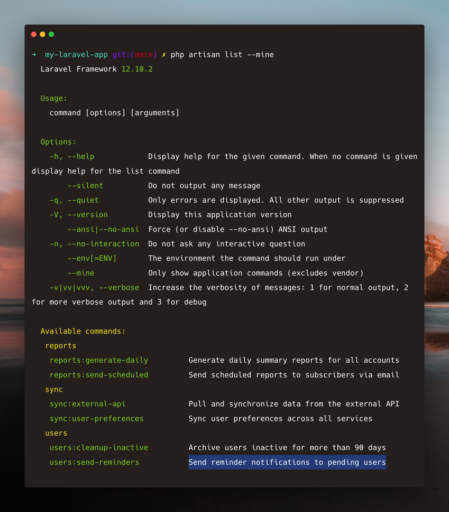

# Laravel Artisan List Mine

[](https://packagist.org/packages/ascend/laravel-artisan-list-mine)
[](https://github.com/CWAscend/laravel-artisan-list-mine/actions/workflows/tests.yml)
[](https://github.com/CWAscend/laravel-artisan-list-mine/actions)
[](composer.json)
[](composer.json)
[](LICENSE)

Ever used `php artisan list` to see what commands are available, or to remind yourself of a command's signature, but found yourself trawling through the long list of built-in Laravel commands? Easily filter them out by only showing your own artisan commands with `php artisan list --mine`.



## Installation

```bash
composer require ascend/laravel-artisan-list-mine
```

The package will automatically register itself via Laravel's package discovery.

## Usage

Use the `--mine` flag with the `list` command to show only your application's commands:

```bash
php artisan list --mine
```

This filters out:
- Built-in Laravel commands (`make:*`, `migrate`, etc.)
- Commands from vendor packages
- Any command not defined in your configured namespaces (default: `App\`)

### Example Output

```
Laravel Framework 12.x

Usage:
  command [options] [arguments]

Options:
  ...
  --mine            Only show application commands (excludes vendor)
  ...

Available commands:
 app
  app:sync-data        Synchronize data from external API
  app:generate-report  Generate monthly reports
 orders
  orders:process       Process pending orders
```

## Configuration

By default, commands in the `App\` namespace are considered application commands. If your project uses additional namespaces (e.g., `Domain\`, `Modules\`), publish the config file:

```bash
php artisan vendor:publish --tag=artisan-list-mine-config
```

Then edit `config/artisan-list-mine.php`:

```php
return [
    'namespaces' => [
        'App\\',
        'Domain\\',
        'Modules\\',
    ],
];
```

## How It Works

The package identifies "application commands" by:

1. Checking if the command class is in a configured namespace
2. Checking if the command has a handler/action in a configured namespace (for closure-based or action-based commands)

## Requirements

- PHP 8.0+
- Laravel 9.0+

## Testing

```bash
composer test
```

## License

MIT License. See [LICENSE](LICENSE) for more information.
